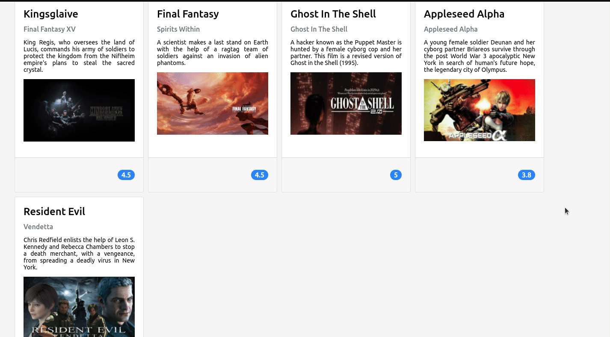

# Movie Cards Library

 

Movie Cards Library é um projeto que desenvolvi durante o módulo de Front-end na Trybe. O principal objetivo era colocar em prática os conceitos de React.

O app exibe uma galeria de filmes em formato de cards que contém o nome, descrição, imagem e rating de cada filme. Neste projeto utilizei React para o desenvolvimento e CSS para a estilização.

 
 

# Tecnologias

 
 

# Como Usar

Este projeto está hospedado no seguinte domínio: [ link ], você pode acessá-lo direto pelo seu navegador. Não é recomendado acessar pelo celular pois ele não possui design responsivo.

Caso queira acessar o código direto em sua máquina, você pode clonar o repositório. Para isso, siga os passos a seguir:

1. Clone o repositório
      git clone git@github.com:LaizaBertelli/movie-cards-library.git

2. Entre no diretório do projeto e instale as dependências
      cd movie-cards-library && npm install

3. Inicie o projeto ou abra-o em seu editor de preferência
      npm start

---
 

Este projeto já está finalizado, mas sintam-se à vontade para contribuir e adicionar novas funcionalidades! :smile:
